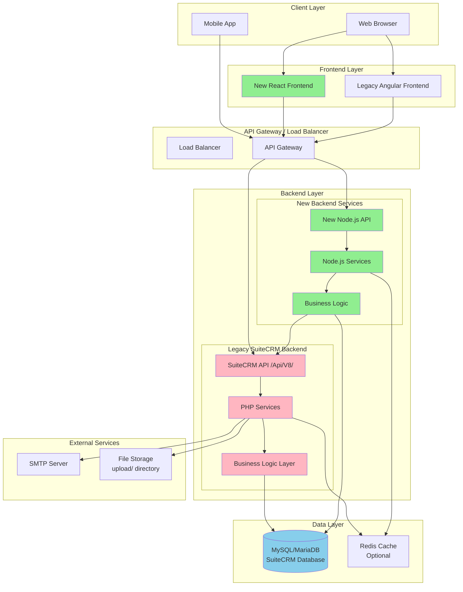
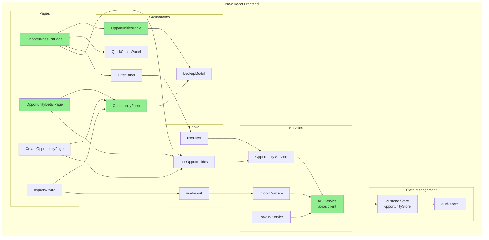
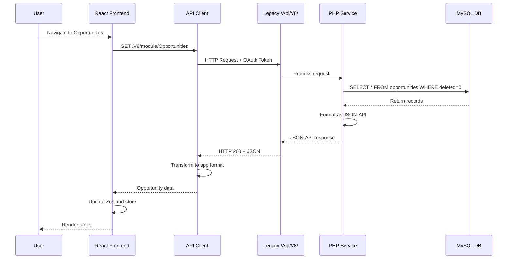
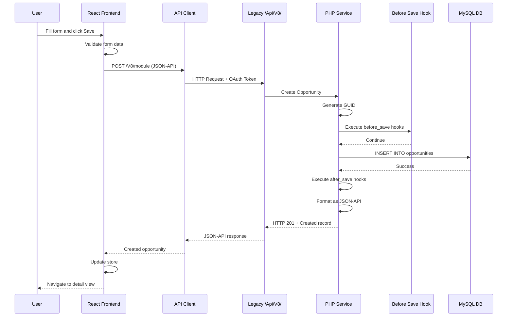
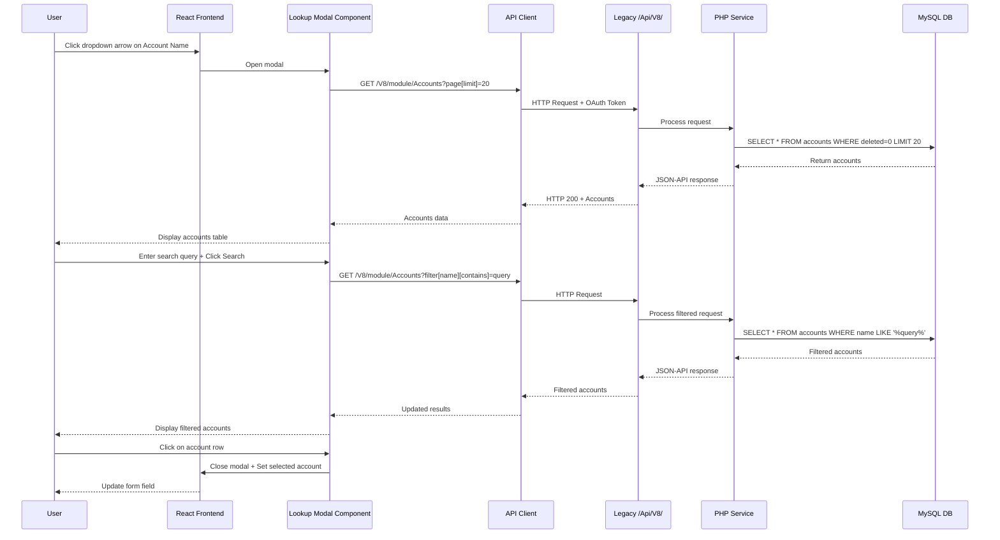
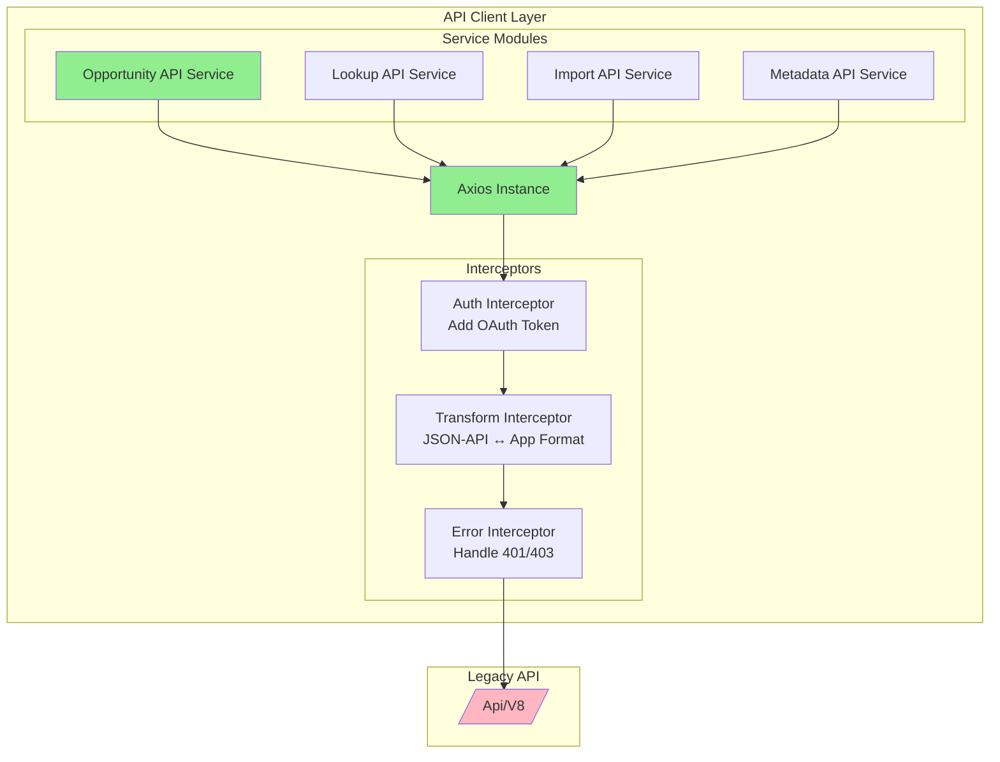
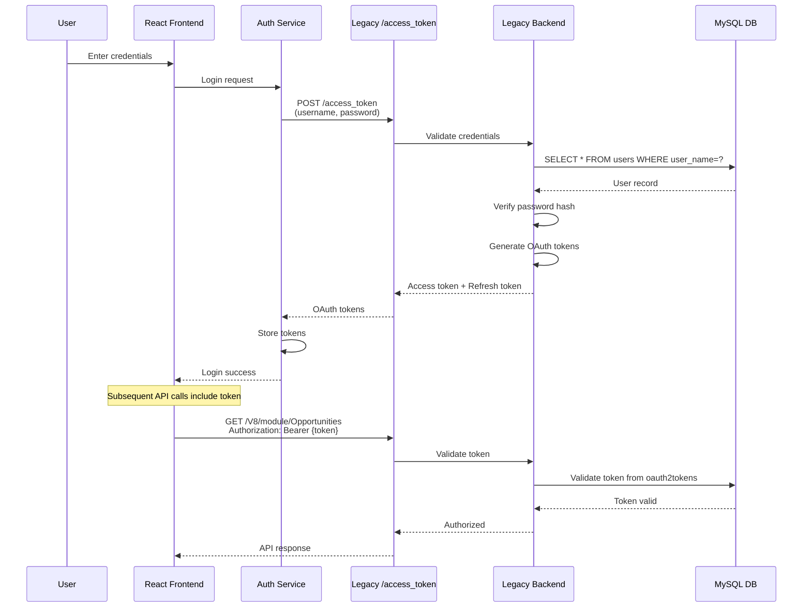
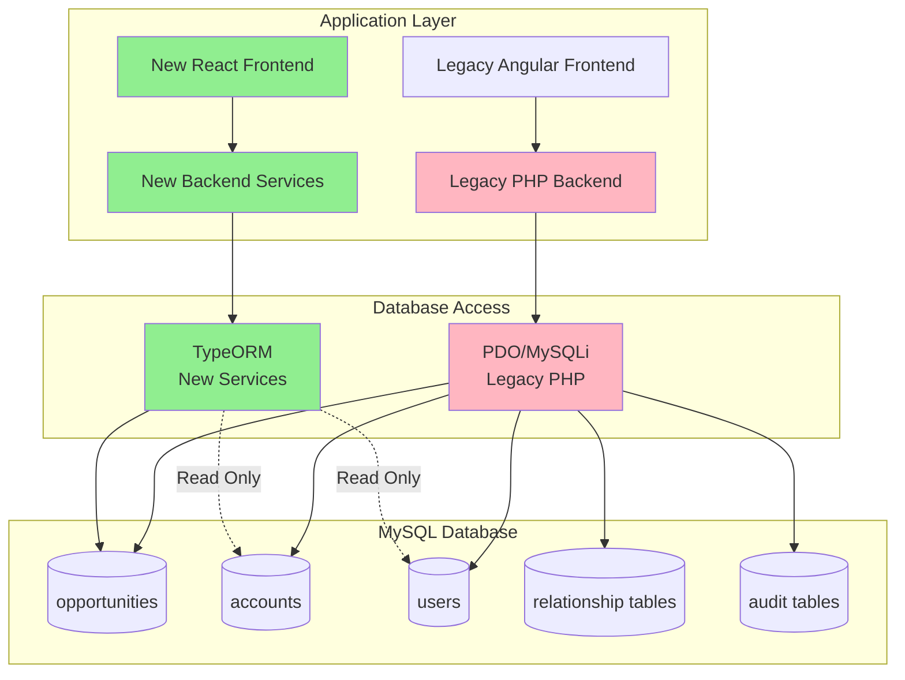
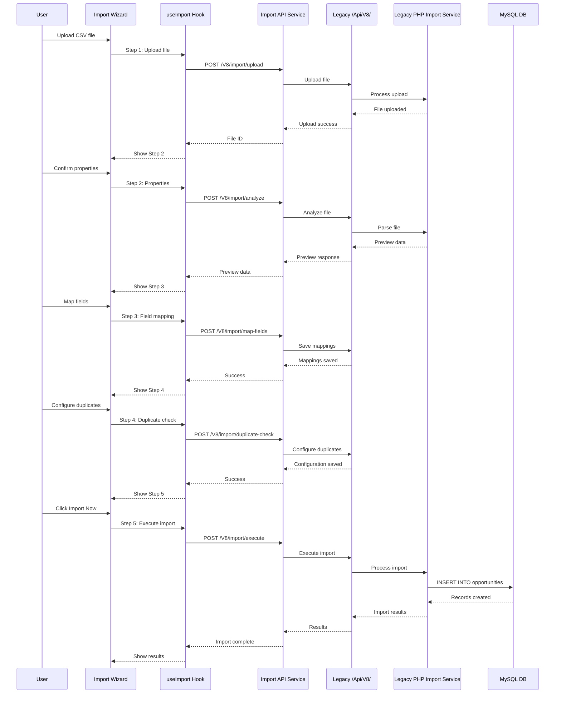

# System Architecture - Legacy SuiteCRM Integration with New Components

**Document Version**: 1.0  
**Last Updated**: 2025-12-13  
**Purpose**: Product-level architecture diagrams showing how legacy SuiteCRM 8.9.1 components integrate with new system components

---

## Table of Contents

1. [System Overview](#system-overview)
2. [High-Level Architecture](#high-level-architecture)
3. [Legacy System Components](#legacy-system-components)
4. [New System Components](#new-system-components)
5. [Integration Architecture](#integration-architecture)
6. [Data Flow Diagrams](#data-flow-diagrams)
7. [API Integration Layer](#api-integration-layer)
8. [Authentication & Authorization Flow](#authentication--authorization-flow)
9. [Database Integration](#database-integration)
10. [Component Interaction Diagrams](#component-interaction-diagrams)

---

## System Overview

### Architecture Philosophy

This system follows a **hybrid integration approach**, where:
- **Legacy SuiteCRM 8.9.1** provides the core backend infrastructure, database, and API layer
- **New Components** (React frontend, Node.js services) integrate via the existing JSON-API interface
- **Shared Database** ensures data consistency between legacy and new systems
- **API Gateway Pattern** provides a unified interface for both legacy and new components

### Technology Stack

**Legacy System (SuiteCRM 8.9.1)**:
- **Backend**: PHP 7.4+, Symfony Framework
- **Database**: MySQL/MariaDB
- **API**: JSON-API RESTful endpoints (`/Api/V8/`)
- **Authentication**: OAuth 2.0 (League OAuth2 Server)
- **Session Management**: PHP Sessions

**New Components**:
- **Frontend**: React 18.x, TypeScript 5.x, Tailwind CSS, Shadcn UI
- **State Management**: Zustand
- **API Client**: Axios
- **New Backend Services**: Node.js 18+, TypeScript, Express 4.x (optional microservices)
- **Authentication**: JWT tokens (issued by legacy OAuth endpoint)

---

## High-Level Architecture

### Overall System Diagram



### Architecture Layers

```
┌─────────────────────────────────────────────────────────────────┐
│                     Client Layer                                 │
│  ┌──────────────┐  ┌──────────────┐  ┌──────────────┐         │
│  │ Web Browser  │  │ Mobile App   │  │   Other      │         │
│  │              │  │              │  │   Clients    │         │
│  └──────┬───────┘  └──────┬───────┘  └──────┬───────┘         │
└─────────┼──────────────────┼──────────────────┼──────────────────┘
          │                  │                  │
          └──────────────────┼──────────────────┘
                             │
┌────────────────────────────▼────────────────────────────────────┐
│                    Presentation Layer                            │
│  ┌──────────────────────┐  ┌──────────────────────┐           │
│  │  New React Frontend  │  │ Legacy Angular FE    │           │
│  │  • React 18.x        │  │ • Angular            │           │
│  │  • TypeScript        │  │ • Legacy UI          │           │
│  │  • Tailwind CSS      │  │                      │           │
│  │  • Shadcn UI         │  │                      │           │
│  └──────────┬───────────┘  └──────────┬───────────┘           │
└─────────────┼──────────────────────────┼───────────────────────┘
              │                          │
              └──────────────┬───────────┘
                             │
┌────────────────────────────▼────────────────────────────────────┐
│                    API Gateway Layer                             │
│  ┌──────────────────────────────────────────────────────┐      │
│  │  API Gateway / Load Balancer                         │      │
│  │  • Route to legacy /Api/V8/                          │      │
│  │  • Route to new /api/v1/                             │      │
│  │  • Authentication middleware                         │      │
│  │  • Rate limiting                                     │      │
│  └──────────────┬───────────────────────┬───────────────┘      │
└─────────────────┼───────────────────────┼──────────────────────┘
                  │                       │
      ┌───────────┘                       └───────────┐
      │                                               │
┌─────▼──────────────────────┐  ┌─────────────────────▼──────┐
│  Legacy SuiteCRM Backend   │  │  New Backend Services      │
│  ┌──────────────────────┐  │  │  ┌──────────────────────┐  │
│  │ /Api/V8/ endpoints   │  │  │  │ /api/v1/ endpoints   │  │
│  │ • Module CRUD        │  │  │  │ • New features       │  │
│  │ • Relationships      │  │  │  │ • Microservices      │  │
│  │ • Metadata           │  │  │  │ • Business logic     │  │
│  │ • OAuth 2.0          │  │  │  └──────────┬───────────┘  │
│  └──────────┬───────────┘  │  │             │              │
│             │               │  │             │              │
│  ┌──────────▼───────────┐  │  │  ┌──────────▼───────────┐  │
│  │ PHP Services         │  │  │  │ Node.js Services     │  │
│  │ • SugarBean          │  │  │  │ • Express            │  │
│  │ • Business Logic     │  │  │  │ • TypeORM            │  │
│  │ • Hooks/Workflows    │  │  │  │ • TypeScript         │  │
│  └──────────┬───────────┘  │  │  └──────────┬───────────┘  │
└─────────────┼───────────────┘  └─────────────┼──────────────┘
              │                                 │
              └─────────────┬───────────────────┘
                            │
┌───────────────────────────▼────────────────────────────────────┐
│                      Data Layer                                 │
│  ┌──────────────────────────────────────────────────────┐     │
│  │  MySQL/MariaDB (SuiteCRM Database)                   │     │
│  │  • opportunities                                     │     │
│  │  • accounts                                          │     │
│  │  • users                                             │     │
│  │  • relationships tables                              │     │
│  │  • audit tables                                      │     │
│  └──────────────────────────────────────────────────────┘     │
│  ┌──────────────────────────────────────────────────────┐     │
│  │  Redis Cache (Optional)                              │     │
│  │  • Session storage                                   │     │
│  │  • API response caching                              │     │
│  └──────────────────────────────────────────────────────┘     │
└────────────────────────────────────────────────────────────────┘
```

---

## Legacy System Components

### SuiteCRM 8.9.1 Core Components

```mermaid
graph LR
    subgraph "Legacy SuiteCRM Architecture"
        subgraph "API Layer"
            V8_API[/Api/V8/ REST API]
            OAUTH[OAuth 2.0 Server]
        end
        
        subgraph "Service Layer"
            SUGAR_BEAN[SugarBean Base Class]
            MODULE_SVC[Module Services<br/>Accounts, Opportunities, etc.]
            REL_SVC[Relationship Services]
            METADATA_SVC[Metadata Services]
        end
        
        subgraph "Business Logic"
            HOOKS[Custom Logic Hooks<br/>before_save, after_save]
            WORKFLOWS[Workflow Engine]
            AUDIT[Audit Trail]
            ACL[Access Control Lists]
        end
        
        subgraph "Data Access"
            DB_LAYER[Database Layer<br/>PDO/MySQLi]
            QUERY_BUILDER[Query Builder]
        end
        
        subgraph "Utilities"
            UPLOAD[UploadFile]
            EMAIL[Email System]
            NOTIFY[Notifications]
        end
    end
    
    V8_API --> SUGAR_BEAN
    OAUTH --> V8_API
    
    SUGAR_BEAN --> MODULE_SVC
    SUGAR_BEAN --> REL_SVC
    SUGAR_BEAN --> METADATA_SVC
    
    MODULE_SVC --> HOOKS
    MODULE_SVC --> WORKFLOWS
    MODULE_SVC --> AUDIT
    MODULE_SVC --> ACL
    
    MODULE_SVC --> DB_LAYER
    DB_LAYER --> QUERY_BUILDER
    
    MODULE_SVC --> UPLOAD
    MODULE_SVC --> EMAIL
    MODULE_SVC --> NOTIFY
    
    style V8_API fill:#FFB6C1
    style SUGAR_BEAN fill:#FFB6C1
    style MODULE_SVC fill:#FFB6C1
```

### Legacy API Endpoint Structure

```
/Api/V8/
├── /module/{moduleName}
│   ├── GET     - List records
│   ├── POST    - Create record
│   ├── PATCH   - Update record
│   └── DELETE  - Delete record
│
├── /module/{moduleName}/{id}
│   ├── GET     - Get single record
│   └── DELETE  - Delete record
│
├── /module/{moduleName}/{id}/relationships/{linkFieldName}
│   ├── GET     - Get relationships
│   ├── POST    - Create relationship
│   └── DELETE  - Delete relationship
│
├── /meta/
│   ├── /modules           - List modules
│   ├── /fields/{module}   - Field definitions
│   ├── /view/{module}/{view} - View metadata
│   └── /swagger.json      - API schema
│
├── /current-user          - Current user info
├── /user-preferences/{id} - User preferences
├── /logout                - Logout
│
└── /access_token          - OAuth token endpoint
```

### Legacy Database Schema (Key Tables)

```
SuiteCRM Database
├── opportunities
│   ├── id (char(36), GUID)
│   ├── name (varchar(50))
│   ├── account_id (char(36))
│   ├── amount (double)
│   ├── sales_stage (varchar(255))
│   ├── date_closed (date)
│   ├── assigned_user_id (char(36))
│   ├── deleted (tinyint(1))
│   └── ...
│
├── accounts
├── users
├── opportunities_contacts (relationship table)
├── opportunities_audit (audit trail)
└── ...
```

---

## New System Components

### New Frontend Architecture



### New Backend Services (Optional)

```
New Node.js Services (Optional Microservices)
├── /api/v1/opportunities
│   ├── GET     - List (delegates to legacy)
│   ├── POST    - Create (delegates to legacy)
│   ├── PATCH   - Update (delegates to legacy)
│   └── DELETE  - Delete (delegates to legacy)
│
├── /api/v1/analytics
│   ├── /pipeline - Pipeline analytics
│   └── /insights - Opportunity insights
│
└── /api/v1/webhooks
    └── /notify - Webhook notifications
```

---

## Integration Architecture

### Integration Points

```mermaid
graph TB
    subgraph "New Frontend"
        REACT[React Application]
    end
    
    subgraph "Integration Layer"
        API_CLIENT[API Client<br/>Axios with interceptors]
        AUTH_MGR[Auth Manager<br/>Token management]
        CACHE_MGR[Cache Manager<br/>Response caching]
    end
    
    subgraph "Legacy API"
        V8_API[/Api/V8/]
        OAUTH_ENDPOINT[/access_token]
    end
    
    subgraph "Legacy Backend"
        PHP_SERVICES[PHP Services]
        DB[(MySQL Database)]
    end
    
    REACT --> API_CLIENT
    API_CLIENT --> AUTH_MGR
    API_CLIENT --> CACHE_MGR
    
    AUTH_MGR --> OAUTH_ENDPOINT
    API_CLIENT --> V8_API
    
    V8_API --> PHP_SERVICES
    PHP_SERVICES --> DB
    
    CACHE_MGR -.->|Cache Hit| REACT
    CACHE_MGR -->|Cache Miss| V8_API
    
    style REACT fill:#90EE90
    style API_CLIENT fill:#90EE90
    style AUTH_MGR fill:#90EE90
    style V8_API fill:#FFB6C1
    style PHP_SERVICES fill:#FFB6C1
```

### Integration Patterns

#### 1. **Direct API Integration Pattern**
New components directly consume legacy SuiteCRM API endpoints.

```
New Frontend → API Client → Legacy /Api/V8/ → PHP Services → Database
```

**Use Cases**:
- CRUD operations
- Metadata retrieval
- Relationship management
- User authentication

#### 2. **Adapter Pattern** (Optional)
New backend services act as adapters between new frontend and legacy API.

```
New Frontend → New API → Adapter Service → Legacy /Api/V8/ → PHP Services → Database
```

**Use Cases**:
- Data transformation
- Aggregated queries
- Caching layer
- Additional business logic

#### 3. **Event-Driven Pattern** (Future)
New components subscribe to legacy system events.

```
Legacy System → Event Bus → New Services → New Frontend
```

**Use Cases**:
- Real-time updates
- Notifications
- Analytics processing

---

## Data Flow Diagrams

### Opportunity List View Data Flow



### Opportunity Create Data Flow



### Lookup Modal Data Flow



---

## API Integration Layer

### API Client Architecture



### API Client Implementation Structure

```typescript
// API Client Configuration
axios.create({
  baseURL: '/Api/V8/',
  headers: {
    'Content-Type': 'application/vnd.api+json',
    'Accept': 'application/vnd.api+json'
  }
})

// Request Interceptor: Add OAuth Token
axios.interceptors.request.use((config) => {
  const token = authStore.getAccessToken();
  config.headers.Authorization = `Bearer ${token}`;
  return config;
});

// Response Interceptor: Transform JSON-API to App Format
axios.interceptors.response.use((response) => {
  return transformJSONAPIResponse(response.data);
});

// Error Interceptor: Handle 401 (Refresh Token)
axios.interceptors.response.use(
  null,
  async (error) => {
    if (error.response?.status === 401) {
      await refreshAccessToken();
      return axios.request(error.config);
    }
    return Promise.reject(error);
  }
);
```

### JSON-API to Application Format Transformation

```typescript
// Legacy JSON-API Format
{
  "data": {
    "type": "Opportunities",
    "id": "550e8400-e29b-41d4-a716-446655440000",
    "attributes": {
      "name": "Opportunity Name",
      "amount": 50000.00,
      "sales_stage": "Qualification"
    },
    "relationships": {
      "account": {
        "data": {
          "type": "Accounts",
          "id": "account-id"
        }
      }
    }
  }
}

// Transformed Application Format
{
  id: "550e8400-e29b-41d4-a716-446655440000",
  name: "Opportunity Name",
  amount: 50000.00,
  salesStage: "Qualification",
  accountId: "account-id",
  account: { id: "account-id", name: "Account Name" }
}
```

---

## Authentication & Authorization Flow

### OAuth 2.0 Flow with Legacy System



### Token Management

```mermaid
graph LR
    subgraph "Token Storage"
        MEMORY[In-Memory Store<br/>Zustand]
        LOCAL[Local Storage<br/>Optional backup]
    end
    
    subgraph "Token Lifecycle"
        ISSUE[Issue Token<br/>Login]
        USE[Use Token<br/>API Calls]
        REFRESH[Refresh Token<br/>401 Response]
        REVOKE[Revoke Token<br/>Logout]
    end
    
    subgraph "Legacy OAuth"
        OAUTH_ENDPOINT[/access_token]
        TOKEN_DB[(oauth2tokens table)]
    end
    
    ISSUE --> OAUTH_ENDPOINT
    OAUTH_ENDPOINT --> TOKEN_DB
    OAUTH_ENDPOINT --> MEMORY
    
    USE --> MEMORY
    MEMORY --> USE
    
    USE -->|401 Error| REFRESH
    REFRESH --> OAUTH_ENDPOINT
    
    REVOKE --> OAUTH_ENDPOINT
    OAUTH_ENDPOINT --> TOKEN_DB
    
    style MEMORY fill:#90EE90
    style OAUTH_ENDPOINT fill:#FFB6C1
```

---

## Database Integration

### Shared Database Architecture



### Database Access Patterns

#### 1. **Read-Only Pattern** (New Components)
New components primarily read from legacy database via API.

```
New Component → API Call → Legacy API → Legacy DB Access → Database
```

#### 2. **Write-Through Pattern** (New Components)
New components write through legacy API to maintain consistency.

```
New Component → API Call → Legacy API → Legacy Business Logic → Database
```

#### 3. **Direct Read Pattern** (Future)
New backend services may read directly from database for performance.

```
New Component → New Backend Service → Direct DB Access → Database
```

**Note**: Direct writes should still go through legacy API to ensure business logic and hooks execute.

---

## Component Interaction Diagrams

### Opportunity Module Interaction

```mermaid
graph TB
    subgraph "User Interface"
        LIST_VIEW[Opportunities List View]
        DETAIL_VIEW[Opportunity Detail View]
        CREATE_VIEW[Create Opportunity View]
        IMPORT_VIEW[Import Wizard]
    end
    
    subgraph "React Components"
        TABLE_COMP[OpportunitiesTable]
        FORM_COMP[OpportunityForm]
        MODAL_COMP[LookupModal]
        CHART_COMP[QuickChartsPanel]
    end
    
    subgraph "Services & Hooks"
        OPP_HOOK[useOpportunities Hook]
        LOOKUP_HOOK[useLookup Hook]
        IMPORT_HOOK[useImport Hook]
    end
    
    subgraph "API Services"
        OPP_SERVICE[Opportunity API Service]
        LOOKUP_SERVICE[Lookup API Service]
        IMPORT_SERVICE[Import API Service]
    end
    
    subgraph "Legacy API"
        V8_MODULE[/V8/module/Opportunities]
        V8_LOOKUP[/V8/module/Accounts]
        V8_IMPORT[/V8/import]
    end
    
    LIST_VIEW --> TABLE_COMP
    LIST_VIEW --> CHART_COMP
    DETAIL_VIEW --> FORM_COMP
    CREATE_VIEW --> FORM_COMP
    
    TABLE_COMP --> OPP_HOOK
    FORM_COMP --> OPP_HOOK
    FORM_COMP --> MODAL_COMP
    MODAL_COMP --> LOOKUP_HOOK
    IMPORT_VIEW --> IMPORT_HOOK
    
    OPP_HOOK --> OPP_SERVICE
    LOOKUP_HOOK --> LOOKUP_SERVICE
    IMPORT_HOOK --> IMPORT_SERVICE
    
    OPP_SERVICE --> V8_MODULE
    LOOKUP_SERVICE --> V8_LOOKUP
    IMPORT_SERVICE --> V8_IMPORT
    
    style LIST_VIEW fill:#90EE90
    style OPP_SERVICE fill:#90EE90
    style V8_MODULE fill:#FFB6C1
```

### Import Workflow Interaction



---

## Integration Best Practices

### 1. **API Contract Adherence**
- Always use JSON-API format for requests/responses
- Follow legacy API endpoint patterns
- Respect legacy field naming conventions

### 2. **Error Handling**
- Handle legacy error response formats
- Map legacy error codes to application errors
- Implement retry logic for transient failures

### 3. **Caching Strategy**
- Cache metadata responses (field definitions, modules)
- Cache user preferences
- Implement cache invalidation on updates

### 4. **Authentication**
- Use OAuth 2.0 tokens from legacy system
- Implement token refresh logic
- Store tokens securely (in-memory preferred)

### 5. **Data Synchronization**
- Ensure writes go through legacy API for business logic
- Handle soft delete flag (`deleted = 0/1`)
- Respect audit trail requirements

### 6. **Performance Optimization**
- Implement request debouncing for search/filter
- Use pagination for large datasets
- Lazy load related data

---

## Migration Strategy Considerations

### Phase 1: API Integration
- New frontend consumes legacy API directly
- Minimal changes to legacy system
- Fastest path to new UI

### Phase 2: Backend Services (Optional)
- Introduce new backend services as adapters
- Add caching and optimization layers
- Gradual migration of business logic

### Phase 3: Data Layer Evolution (Future)
- Evaluate direct database access for reads
- Maintain write-through legacy API
- Consider read replicas for performance

### Phase 4: Complete Migration (Future)
- Migrate business logic to new services
- Maintain data compatibility
- Eventual deprecation of legacy components

---

## Security Considerations

### Authentication
- OAuth 2.0 tokens issued by legacy system
- Token validation at legacy API layer
- Secure token storage in new frontend

### Authorization
- ACL checks enforced by legacy backend
- Role-based access via legacy user system
- Permission inheritance from legacy

### Data Protection
- All API calls over HTTPS
- Sensitive data encrypted in transit
- Legacy database security maintained

---

## Monitoring & Observability

### Metrics to Track
- API response times (legacy vs new)
- Error rates by endpoint
- Token refresh frequency
- Cache hit rates

### Logging
- Log all API requests/responses
- Track authentication failures
- Monitor integration errors

### Health Checks
- Legacy API availability
- Database connectivity
- Token service health

---

## References

- **Legacy Backend Requirements**: `product-info/system-backend-requirement.md`
- **Frontend Requirements**: `product-info/system-frontend-requirements.md`
- **Opportunity Module Notes**: `.opportunity-module-notes.md`
- **Opportunity Technical Spec**: `specs/opportunity/technical-spec.md`

---

**Document Status**: Draft  
**Next Review**: After initial integration implementation  
**Owner**: Architecture Team

