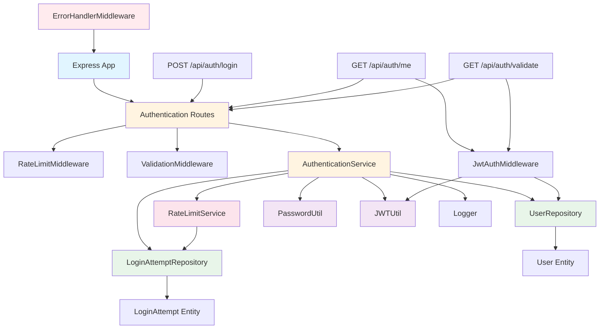

# Implementation Plan: Authentication Backend (Login)

**Branch**: `001-authentication-login` | **Date**: 2025-01-XX | **Spec**: `specs/authentication/backend-specs.md`  
**Status**: Needs Verification ⚠️  
**Started**: 2025-01-XX  
**Completed**: 2025-01-XX  
**Input**: Backend implementation for authentication login feature. Refer to spec: `specs/authentication/backend-specs.md` and requirements: `requirements/authentication/backend-requirements.md`

## Summary

Implement the backend authentication login feature that allows users (Admin and Employee) to securely authenticate and receive JWT tokens for accessing protected endpoints. The implementation includes user credential validation, password hashing verification, JWT token generation, rate limiting, input validation, account status checking, login attempt logging, and comprehensive error handling. The feature uses Node.js with Express and TypeScript, TypeORM for database access, bcrypt for password hashing, JWT for token generation, express-validator for input validation, express-rate-limit for rate limiting, and follows security best practices.

## Technical Context

**Language/Version**: TypeScript 5.x, Node.js 18+, Express 4.x  
**Primary Dependencies**: Express, TypeORM, bcrypt, jsonwebtoken, express-validator, express-rate-limit, cors, helmet  
**Database**: PostgreSQL (or configured database)  
**Testing**: Jest, supertest, jest-when  
**Target Platform**: Node.js server  
**Project Type**: RESTful API backend  
**Performance Goals**: Login endpoint responds within 500ms (95th percentile), handles 100 concurrent requests  
**Constraints**: Security best practices (password hashing, rate limiting, input validation), prevent credential enumeration, comprehensive logging  
**Scale/Scope**: Single authentication module with login endpoint, token validation, user management integration, and security features

## Constitution Check

*GATE: Must pass before implementation. Re-check after design.*

- [x] TDD approach: Tests written before implementation for all services, repositories, and controllers
- [x] Cursor rules compliance: Follows project-structure.mdc, auth-security.mdc, controller.mdc, entity.mdc, repository.mdc, unit-testing.mdc
- [x] Security: Password hashing (bcrypt with 10+ rounds), rate limiting, input validation, prevent credential enumeration
- [x] Performance: Database indexing, connection pooling, optimized queries, response time targets
- [x] Code quality: TypeScript strict mode, exception handling with BusinessException, comprehensive logging
- [x] Snap framework: Use logger from @snap/core, BusinessException for errors, custom validators where applicable

## Project Structure

### Documentation (this feature)

```text
specs/authentication/
├── backend-plan.md              # This file
├── backend-specs.md              # Feature specification
└── frontend-specs.md             # Frontend specification (reference)
```

### Source Code (repository root)

```text
backend/
├── src/
│   ├── modules/
│   │   └── authentication/
│   │       ├── authentication.routes.ts
│   │       ├── authentication.service.ts
│   │       ├── authentication.service.spec.ts
│   │       ├── authentication.repository.ts
│   │       ├── authentication.repository.spec.ts
│   │       ├── authentication.entity.ts
│   │       ├── authentication.dto.ts
│   │       ├── authentication.validator.ts
│   │       ├── middleware/
│   │       │   ├── jwt-auth.middleware.ts
│   │       │   └── rate-limit.middleware.ts
│   │       └── utils/
│   │           ├── password.util.ts
│   │           └── jwt.util.ts
│   ├── constants/
│   │   └── enums/
│   │       ├── user-role.enum.ts
│   │       └── account-status.enum.ts
│   ├── config/
│   │   ├── database.ts
│   │   └── app.ts
│   ├── middleware/
│   │   ├── error-handler.middleware.ts
│   │   └── request-logger.middleware.ts
│   ├── utils/
│   │   └── logger.ts
│   ├── app.ts
│   └── server.ts
└── migration/
    └── XXXX-create-users-and-login-attempts.ts
```

**Structure Decision**: Module-based structure adapted for Express. Authentication feature is self-contained in `src/modules/authentication/` with routes (instead of controller), service, repository, entity, DTOs, validators, middleware, and utilities. Middleware replaces guards. Enums are in global constants directory. Express app setup in `src/app.ts` and server entry in `src/server.ts`.

## Tasks

1. [x] **Create database entities and migrations** - Design and create User and LoginAttempt entities with TypeORM. User entity includes id, username (unique, indexed, case-insensitive), passwordHash, role (enum: Admin/Employee), accountStatus (enum: Active/Blocked/Suspended), displayName, email, timestamps. LoginAttempt entity includes id, username, ipAddress, success, failureReason, attemptTimestamp. Create database migrations for both tables with proper indexes (username index on users table). Write unit tests for entity validation and relationships.

2. [x] **Set up Express application structure** - Create Express app setup in `src/app.ts` with middleware configuration (cors, helmet, express.json, express.urlencoded). Create server entry point in `src/server.ts`. Set up TypeORM database connection in `src/config/database.ts`. Create global error handler middleware. Create request logger middleware. Write unit tests for app setup and middleware.

3. [x] **Implement User repository layer with TDD** - Create UserRepository extending IGenericRepository<User> with findByUsername method (case-insensitive lookup). Implement methods using TypeORM built-in methods (findOne, find) avoiding queryBuilder unless necessary. Include proper error handling. Write comprehensive unit tests using jest-when for mocking, covering findByUsername with existing/non-existing users, case-insensitive matching, and error scenarios.

4. [x] **Implement LoginAttempt repository layer with TDD** - Create LoginAttemptRepository extending IGenericRepository<LoginAttempt> with methods for tracking login attempts: createAttempt, findRecentAttemptsByIp, findRecentAttemptsByUsername, countRecentAttemptsByIp, countRecentAttemptsByUsername. Use insert() method instead of save() for new records. Write unit tests using jest-when covering all methods and edge cases.

5. [x] **Implement password hashing and verification utilities** - Create password utility functions in `src/modules/authentication/utils/password.util.ts` using bcrypt with minimum 10 salt rounds. Functions: hashPassword (async), verifyPassword (async, constant-time comparison), generateSalt. Use environment variable for salt rounds (default 10). Write unit tests covering password hashing, verification with correct/incorrect passwords, and constant-time comparison verification.

6. [x] **Implement JWT token generation and validation** - Create JWT utility in `src/modules/authentication/utils/jwt.util.ts` with methods: generateToken (user data, expiration), verifyToken (token string), decodeToken (without verification). Use jsonwebtoken library. Token payload includes: id, username, role, iat, exp. Token expiration configurable via environment variable (default 24 hours). Write unit tests covering token generation, verification, expiration handling, and invalid token scenarios.

7. [x] **Implement rate limiting service with TDD** - Create RateLimitService with methods: checkRateLimitByIp (ip, maxAttempts, windowMinutes), checkRateLimitByUsername (username, maxAttempts, windowMinutes), recordAttempt. Implement logic for 5 attempts per IP per 15 minutes and 10 attempts per username per hour. Use LoginAttemptRepository to query recent attempts. Return rate limit status with retryAfter timestamp. Write comprehensive unit tests using jest-when covering all rate limit scenarios, edge cases, and concurrent requests.

8. [x] **Create input validation with express-validator** - Create validation middleware in `src/modules/authentication/authentication.validator.ts` using express-validator. Validate LoginDto with username (required, string, length 1-255, trimmed) and password (required, string, length 1-255, trimmed). Create validation error response format. Create LoginResponseDto and ErrorResponseDto types. Write unit tests for validation middleware covering all validation rules and error responses.

9. [x] **Implement authentication service with business logic and TDD** - Create AuthenticationService with login method. Business logic: validate input (trim whitespace, check required fields), check rate limits (by IP and username), find user by username (case-insensitive), verify password (constant-time), check account status (reject Blocked/Suspended), generate JWT token, log successful attempt, return token and user info. Handle all error cases: invalid credentials (generic message, same response time), account blocked/suspended (403), rate limit exceeded (429), system errors (500). Write comprehensive unit tests using jest-when covering all scenarios: successful login, invalid username, invalid password, blocked account, suspended account, rate limit exceeded, database errors, password hashing errors, token generation errors. Ensure tests prevent credential enumeration (same response for invalid username vs password).

10. [x] **Implement authentication routes and middleware** - Create authentication routes in `src/modules/authentication/authentication.routes.ts` with POST /api/auth/login endpoint. Apply rate limiting middleware. Use express-validator for input validation. Call AuthenticationService.login(). Return LoginResponseDto on success. Handle errors via error handler middleware. Create JWT authentication middleware in `src/modules/authentication/middleware/jwt-auth.middleware.ts` to extract and verify tokens from Authorization header, validate user exists and is active, attach user to request. Write unit tests using supertest covering endpoint behavior, validation, service integration, and error responses.

11. [x] **Implement additional authentication endpoints** - Create GET /api/auth/me endpoint (protected with JWT middleware) returning current user info. Create GET /api/auth/validate endpoint (protected) for token validation. Create POST /api/auth/logout endpoint (protected) for session invalidation (optional, as JWT is stateless). Write unit tests for all endpoints using supertest.

12. [x] **Add comprehensive logging** - Create logger utility in `src/utils/logger.ts` (or use existing logging solution). Integrate logger in AuthenticationService. Log successful logins with user info and IP. Log failed login attempts with username, IP, and failure reason. Log rate limit violations. Log system errors with full error details. Use appropriate log levels (info for success, warn for failures, error for system errors). Write unit tests verifying logging calls with correct parameters.

13. [x] **Add integration tests** - Create end-to-end integration tests using Jest and Supertest. Test complete login flow: valid credentials, invalid credentials, rate limiting, account status checks, concurrent requests. Test database interactions, password hashing, token generation. Verify response times meet performance requirements. Write integration tests covering all user stories and acceptance criteria from spec.

14. [ ] **Optimize database queries and add indexes** - Verify username index exists on users table. Optimize LoginAttempt queries for rate limiting (add indexes on ipAddress, username, attemptTimestamp). Use database connection pooling. Review query performance and optimize if needed. Write performance tests to verify 500ms response time target.

15. [x] **Add error handling and edge case coverage** - Ensure all edge cases from spec are handled: database connection failures, password hashing failures, token generation failures, concurrent login requests, account status changes during authentication, rate limiting storage failures, login attempt logging failures. Add appropriate error responses and logging. Write unit tests for all edge cases.

## Technical Notes

### Architecture Approach

The authentication feature follows a layered architecture pattern with clear separation of concerns:

- **Route Layer**: Handles HTTP requests, applies middleware (rate limiting, validation), delegates to service
- **Middleware Layer**: Validates input (express-validator), rate limiting, JWT authentication, error handling
- **Service Layer**: Contains business logic, orchestrates repository calls, handles password verification, token generation, rate limiting
- **Repository Layer**: Handles database access using TypeORM, provides data access methods
- **Entity Layer**: Defines database schema and relationships
- **Utility Layer**: Password hashing, JWT token generation/validation

**Data Flow**:
1. Client sends POST /api/auth/login with credentials
2. Express receives request, applies middleware (cors, helmet, body parser)
3. Rate limiting middleware checks IP-based rate limits
4. Validation middleware validates request body (username, password)
5. Route handler calls AuthenticationService.login()
6. Service checks rate limits (by IP and username)
7. Service finds user by username (case-insensitive)
8. Service verifies password (constant-time comparison)
9. Service checks account status (must be Active)
10. Service generates JWT token
11. Service logs successful attempt
12. Service returns token and user info
13. Route handler returns JSON response to client
14. Error handler middleware catches any errors and formats response

### Integration Points

**Internal Integrations**:
- **User Management Module**: Retrieves user data from User entity/repository
- **Logging System**: Uses logger from @snap/core for all logging operations
- **Exception Handling**: Uses BusinessException from @snap/core for error responses
- **Database**: TypeORM with configured database (PostgreSQL)
- **Configuration**: Environment variables for JWT secret, expiration, bcrypt rounds

**External Dependencies**:
- **bcrypt**: Password hashing and verification
- **jsonwebtoken**: JWT token generation and validation
- **express-validator**: Input validation middleware
- **express-rate-limit**: Basic rate limiting (supplemented by custom service)
- **cors**: Cross-origin resource sharing
- **helmet**: Security headers
- **TypeORM**: Database access and ORM

**API Endpoints Provided**:
- `POST /api/auth/login` - User authentication
- `GET /api/auth/me` - Get current user info (protected)
- `GET /api/auth/validate` - Validate token (protected)
- `POST /api/auth/logout` - Logout (protected, optional)

### Technical Decisions

1. **Password Hashing**: Using bcrypt with minimum 10 salt rounds. This provides strong security against rainbow table attacks. Salt rounds configurable via environment variable for flexibility.

2. **JWT Tokens**: Using stateless JWT tokens for authentication. Tokens include user ID, username, role, and expiration. This eliminates need for server-side session storage and enables horizontal scaling.

3. **Rate Limiting**: Implementing custom rate limiting service using LoginAttempt table. This provides persistent rate limiting across server restarts and allows for detailed tracking. Two-tier rate limiting: by IP (5 attempts/15 min) and by username (10 attempts/hour).

4. **Credential Enumeration Prevention**: Ensuring same response time and format for invalid username vs invalid password. This prevents attackers from determining which credential is incorrect through timing analysis.

5. **Account Status Checking**: Checking account status after credential validation but before token generation. This prevents blocked/suspended users from receiving tokens even with valid credentials.

6. **Error Handling**: Using custom error classes or standard Error objects with HTTP status codes. Letting global error handler middleware handle HTTP response formatting. No try-catch in service unless specific cleanup needed. Error handler middleware formats all errors consistently.

7. **Repository Pattern**: Using IGenericRepository pattern for consistent data access. Preferring built-in TypeORM methods (findOne, find) over queryBuilder for better type safety. Using insert() instead of save() for new records to avoid unnecessary SELECT queries.

8. **Testing Strategy**: Using jest-when for all mocking to ensure readable and robust tests. Writing tests before implementation (TDD). Focusing on business logic, not pass-through methods.

### Data Model

**User Entity**:
```typescript
@Entity('users')
@Index('idx_users_username', ['username'])
export class User extends Audit {
  @Column({ name: 'username', unique: true })
  username: string; // Case-insensitive lookup

  @Column({ name: 'password_hash' })
  passwordHash: string; // Never store plain text

  @Column({ name: 'role', type: 'enum', enum: UserRole })
  role: UserRole; // Admin | Employee

  @Column({ name: 'account_status', type: 'enum', enum: AccountStatus })
  accountStatus: AccountStatus; // Active | Blocked | Suspended

  @Column({ name: 'display_name', nullable: true })
  displayName?: string;

  @Column({ name: 'email', nullable: true })
  email?: string;

  @Column({ name: 'last_login_at', nullable: true })
  lastLoginAt?: Date;
}
```

**LoginAttempt Entity**:
```typescript
@Entity('login_attempts')
@Index('idx_login_attempts_ip_timestamp', ['ipAddress', 'attemptTimestamp'])
@Index('idx_login_attempts_username_timestamp', ['username', 'attemptTimestamp'])
export class LoginAttempt extends Audit {
  @Column({ name: 'username' })
  username: string;

  @Column({ name: 'ip_address' })
  ipAddress: string;

  @Column({ name: 'success' })
  success: boolean;

  @Column({ name: 'failure_reason', nullable: true })
  failureReason?: string;

  @Column({ name: 'attempt_timestamp' })
  attemptTimestamp: Date;
}
```

**Enums**:
```typescript
export enum UserRole {
  ADMIN = 'Admin',
  EMPLOYEE = 'Employee',
}

export enum AccountStatus {
  ACTIVE = 'Active',
  BLOCKED = 'Blocked',
  SUSPENDED = 'Suspended',
}
```

### Mermaid Diagrams

#### Authentication Flow Sequence Diagram


#### Component Architecture Diagram



## Complexity Tracking

> **No constitutional violations identified. All decisions align with cursor rules and best practices.**

## Next Steps

1. Review this plan and verify technical approach aligns with team standards
2. Set up feature branch: `001-authentication-login`
3. Run `/snap/implement` to begin implementation:
   - `/snap/implement 1-3` - Set up database layer (entities, migrations, repositories)
   - `/snap/implement 4-5` - Implement password and JWT utilities
   - `/snap/implement 6-7` - Implement rate limiting and authentication service
   - `/snap/implement 8-11` - Create DTOs, controller, guards, and endpoints
   - `/snap/implement 12-15` - Add logging, integration tests, optimization, and edge cases
   - Or `/snap/implement all` - Implement all tasks sequentially

