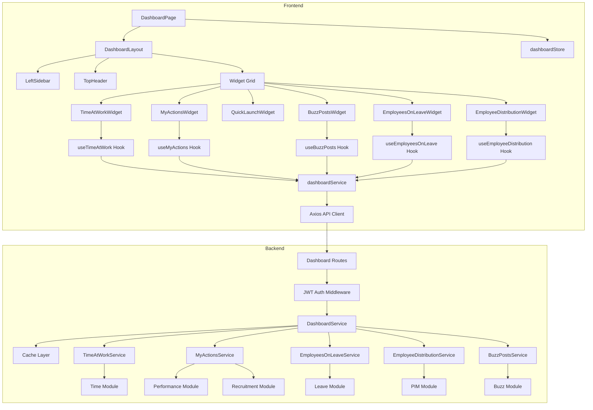
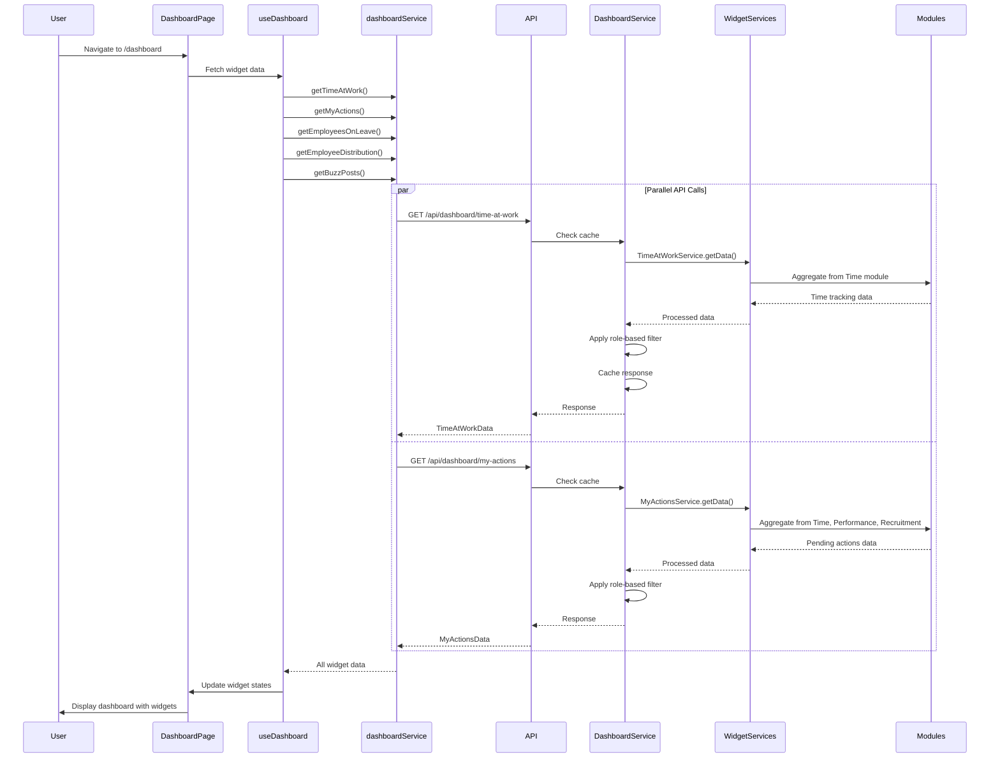

# Implementation Plan: Dashboard Module

**Branch**: `002-dashboard` | **Date**: 2025-01-XX | **Spec**: `specs/dashboard/spec.md`  
**Status**: In Progress 🔄  
**Started**: 2025-01-XX  
**Input**: Frontend implementation using React + Tailwind. Backend implementation using Node.js + Express.

## Summary

Implement the dashboard module that provides authenticated users (Admin and Employee) with a personalized landing page displaying key information and quick actions through six widgets: Time at Work, My Actions, Quick Launch, Buzz Latest Posts, Employees on Leave Today, and Employee Distribution by Sub Unit. The implementation includes a responsive layout with left navigation sidebar, top header, widget grid, role-based data filtering, API integration for widget data, state management, error handling, and performance optimization. The frontend uses React with TypeScript, Tailwind CSS, Shadcn UI components, Zustand for state management, and Axios for API calls. The backend uses Node.js with Express, TypeORM for data access, aggregates data from multiple modules (Time, Leave, PIM, Performance, Recruitment, Buzz), implements role-based filtering, caching, and comprehensive error handling.

## Technical Context

**Frontend:**
- **Language/Version**: TypeScript 5.x, React 18.x
- **Primary Dependencies**: React, React Router, React Hook Form, Zod, Shadcn UI, Radix UI, Tailwind CSS, Axios, Zustand, Chart.js/Recharts (for charts)
- **Storage**: localStorage/sessionStorage for sidebar state, Zustand store for dashboard state
- **Testing**: Vitest, React Testing Library, @testing-library/user-event
- **Target Platform**: Web browsers (Chrome, Firefox, Safari, Edge - latest 2 versions)
- **Performance Goals**: Dashboard loads within 2 seconds, widgets display within 3 seconds, API calls respond within 200ms
- **Constraints**: WCAG AA accessibility, responsive design (320px+), role-based data filtering

**Backend:**
- **Language/Version**: TypeScript 5.x, Node.js 18+, Express 4.x
- **Primary Dependencies**: Express, TypeORM, jsonwebtoken, express-validator, cors, helmet
- **Database**: PostgreSQL (or configured database)
- **Testing**: Jest, supertest, jest-when
- **Target Platform**: Node.js server
- **Performance Goals**: API endpoints respond within 200ms (95th percentile), handles 100 concurrent requests
- **Constraints**: Role-based filtering, caching strategy, graceful module failure handling

## Constitution Check

*GATE: Must pass before implementation. Re-check after design.*

- [x] TDD approach: Tests written before implementation for all components, hooks, services, repositories, and routes
- [x] Cursor rules compliance: Follows frontend-structure.mdc, react-components.mdc, frontend-styling.mdc, project-structure.mdc, controller.mdc, repository.mdc
- [x] Security: JWT authentication, role-based data filtering, input validation, XSS prevention
- [x] Performance: Caching, parallel API requests, optimized queries, response time targets
- [x] Accessibility: WCAG AA compliance, keyboard navigation, ARIA labels, screen reader support
- [x] Code quality: TypeScript strict mode, ESLint compliance, clean code principles, comprehensive error handling

## Project Structure

### Documentation (this feature)

```text
specs/dashboard/
├── plan.md                    # This file
├── spec.md                    # Unified feature specification
├── frontend-specs.md          # Frontend specification (reference)
└── backend-specs.md           # Backend specification (reference)
```

### Source Code (repository root)

**Frontend:**
```text
frontend/
├── src/
│   ├── features/
│   │   └── dashboard/
│   │       ├── components/
│   │       │   ├── DashboardPage.tsx
│   │       │   ├── DashboardLayout.tsx
│   │       │   ├── LeftSidebar.tsx
│   │       │   ├── TopHeader.tsx
│   │       │   ├── TimeAtWorkWidget.tsx
│   │       │   ├── MyActionsWidget.tsx
│   │       │   ├── QuickLaunchWidget.tsx
│   │       │   ├── BuzzPostsWidget.tsx
│   │       │   ├── EmployeesOnLeaveWidget.tsx
│   │       │   ├── EmployeeDistributionWidget.tsx
│   │       │   ├── WidgetContainer.tsx
│   │       │   └── UserProfileMenu.tsx
│   │       ├── hooks/
│   │       │   ├── useDashboard.ts
│   │       │   ├── useTimeAtWork.ts
│   │       │   ├── useMyActions.ts
│   │       │   ├── useEmployeesOnLeave.ts
│   │       │   ├── useEmployeeDistribution.ts
│   │       │   └── useBuzzPosts.ts
│   │       ├── services/
│   │       │   └── dashboardService.ts
│   │       ├── types/
│   │       │   └── dashboard.types.ts
│   │       └── __tests__/
│   │           ├── DashboardPage.test.tsx
│   │           ├── TimeAtWorkWidget.test.tsx
│   │           ├── useDashboard.test.ts
│   │           └── dashboardService.test.ts
│   ├── components/
│   │   └── ui/                # Shadcn UI components
│   ├── store/
│   │   └── dashboardStore.ts  # Dashboard state management
│   └── routes/
│       └── index.tsx          # Route configuration
```

**Backend:**
```text
backend/
├── src/
│   ├── modules/
│   │   └── dashboard/
│   │       ├── dashboard.routes.ts
│   │       ├── dashboard.service.ts
│   │       ├── dashboard.service.spec.ts
│   │       ├── dashboard.dto.ts
│   │       ├── dashboard.validator.ts
│   │       ├── services/
│   │       │   ├── time-at-work.service.ts
│   │       │   ├── my-actions.service.ts
│   │       │   ├── employees-on-leave.service.ts
│   │       │   ├── employee-distribution.service.ts
│   │       │   └── buzz-posts.service.ts
│   │       └── utils/
│   │           └── cache.util.ts
│   ├── middleware/
│   │   └── jwt-auth.middleware.ts  # Reuse from authentication module
│   └── utils/
│       └── logger.ts
```

**Structure Decision**: Feature-based structure for frontend following `.cursor/rules/frontend-structure.mdc`. Dashboard feature is self-contained in `src/features/dashboard/` with components, hooks, services, types, and tests. Module-based structure for backend following `.cursor/rules/project-structure.mdc`. Dashboard module in `src/modules/dashboard/` with routes, service, DTOs, validators, and widget-specific services.

## Tasks

1. [x] **Set up dashboard types and interfaces (Frontend)** - Create TypeScript types in `src/features/dashboard/types/dashboard.types.ts`. Define interfaces for TimeAtWorkData, Action, EmployeeOnLeave, DistributionData, BuzzPost, DashboardState, and all widget data types. Include types for API requests and responses. Export types for use across the feature. Write unit tests for type validation.

2. [x] **Create dashboard service layer (Frontend)** - Implement `src/features/dashboard/services/dashboardService.ts` with functions for each widget: getTimeAtWork, getMyActions, getEmployeesOnLeave, getEmployeeDistribution, getBuzzPosts. Each function calls respective backend API endpoint using Axios. Handle request/response transformation, error mapping, and role-based data handling. Include proper TypeScript types and error handling. Write unit tests with mocked Axios responses covering success, 401, 500, and network error scenarios for each endpoint.

3. [ ] **Implement dashboard state management (Frontend)** - Create dashboard store using Zustand in `src/store/dashboardStore.ts` or `src/features/dashboard/store/dashboardStore.ts`. Manage dashboard state: widget data states (loading, error, data), sidebar collapsed/expanded state, active route. Include actions for updating widget data, toggling sidebar, setting active route. Persist sidebar state in localStorage. Write unit tests for all state mutations and actions.

4. [x] **Create custom hooks for widget data fetching (Frontend)** - Implement custom hooks in `src/features/dashboard/hooks/`: useTimeAtWork, useMyActions, useEmployeesOnLeave, useEmployeeDistribution, useBuzzPosts, and useDashboard (aggregated). Each hook uses dashboardService to fetch data, manages loading/error states, handles retry logic, and integrates with dashboard store. Write unit tests for all hooks using React Testing Library hooks testing utilities.

5. [x] **Implement dashboard layout components (Frontend)** - Create layout components: DashboardLayout (main container), LeftSidebar (navigation with logo, search, menu items, collapse/expand), TopHeader (page title, upgrade button, user profile, help icon). LeftSidebar includes navigation menu items (Admin, PIM, Leave, Time, etc.) with icons, active state highlighting, and collapse/expand functionality. TopHeader includes user profile dropdown menu. Use Shadcn UI components and Tailwind CSS. Ensure responsive design and accessibility (WCAG AA). Write component tests covering all props, interactions, and accessibility features.

6. [x] **Implement dashboard widget components (Frontend)** - Create six widget components: TimeAtWorkWidget (punch-in status, today's hours, weekly bar chart using Chart.js/Recharts), MyActionsWidget (pending actions list with counts, clickable items), QuickLaunchWidget (grid of 6 quick action buttons), BuzzPostsWidget (latest posts with author info, images, timestamps), EmployeesOnLeaveWidget (employee list or empty state), EmployeeDistributionWidget (pie chart with color coding). Each widget uses WidgetContainer wrapper for consistent styling, loading states, error states, and empty states. Use Shadcn UI components and Tailwind CSS. Ensure responsive design and accessibility. Write component tests for each widget covering data display, loading states, error states, empty states, and user interactions.

7. [x] **Create dashboard page and route integration (Frontend)** - Implement DashboardPage component in `src/features/dashboard/components/DashboardPage.tsx` that orchestrates layout and widgets. Integrate with React Router, add protected route for `/dashboard`. Implement redirect logic for unauthenticated users. Use useDashboard hook to fetch all widget data in parallel. Handle widget loading states and errors independently. Write component tests covering page load, widget rendering, error handling, and navigation.

8. [x] **Implement dashboard DTOs and validators (Backend)** - Create DTOs in `src/modules/dashboard/dashboard.dto.ts` for all widget responses: TimeAtWorkResponseDto, MyActionsResponseDto, EmployeesOnLeaveResponseDto, EmployeeDistributionResponseDto, BuzzPostsResponseDto. Create query parameter DTOs for optional parameters (date, limit). Create validation middleware in `dashboard.validator.ts` using express-validator for query parameters. Write unit tests for DTOs and validators.

9. [x] **Create widget-specific services with data aggregation (Backend)** - Implement services in `src/modules/dashboard/services/`: TimeAtWorkService (calculates today's hours, aggregates weekly hours, handles timezone), MyActionsService (aggregates from Time, Performance, Recruitment modules with role-based filtering), EmployeesOnLeaveService (filters by date, applies role-based filtering), EmployeeDistributionService (groups by sub-unit, calculates percentages, assigns colors), BuzzPostsService (retrieves latest posts, sorts by timestamp, applies limit). Each service handles role-based data filtering (Admin sees all, Employee sees filtered). Write comprehensive unit tests using jest-when covering all business logic, role-based filtering, calculations, and error scenarios.

10. [x] **Implement dashboard service with caching and error handling (Backend)** - Create DashboardService in `src/modules/dashboard/dashboard.service.ts` that orchestrates widget services. Implement caching strategy using in-memory cache or Redis (cache widget data for 1-5 minutes, cache key includes user ID and role). Handle module unavailability gracefully (return partial data, log errors, don't fail entire request). Aggregate data from all widget services. Apply role-based filtering consistently. Write comprehensive unit tests covering caching, error handling, partial data scenarios, and role-based filtering.

11. [x] **Create dashboard API routes and middleware (Backend)** - Implement routes in `src/modules/dashboard/dashboard.routes.ts` with endpoints: GET /api/dashboard/time-at-work, GET /api/dashboard/my-actions, GET /api/dashboard/employees-on-leave (with optional date query param), GET /api/dashboard/employee-distribution, GET /api/dashboard/buzz/latest (with optional limit query param), GET /api/dashboard/summary (optional aggregated endpoint). Apply JWT authentication middleware to all routes. Use express-validator for query parameter validation. Call respective dashboard service methods. Return appropriate DTOs. Handle errors via error handler middleware. Write integration tests using supertest covering all endpoints, authentication, authorization, query parameters, role-based filtering, and error scenarios.

12. [x] **Add comprehensive logging and monitoring (Backend)** - Integrate logger in DashboardService and widget services. Log all dashboard API requests (user ID, endpoint, timestamp, response time). Log dashboard data aggregation errors (module name, error details, user ID). Log authorization failures (user ID, endpoint, attempted action, reason). Use appropriate log levels (info for success, warn for errors, error for system failures). Write unit tests verifying logging calls with correct parameters.

13. [x] **Optimize performance and add database indexes (Backend)** - Review and optimize database queries for all widget services. Ensure proper indexes on frequently queried columns (user ID, date fields, sub-unit fields). Optimize aggregation queries (minimize N+1 queries, use joins where appropriate). Implement database connection pooling. Add query performance monitoring. Write performance tests to verify 200ms response time target for 95% of requests.

14. [x] **Add integration tests and end-to-end testing** - Create end-to-end integration tests for complete dashboard flow: user authentication, dashboard page load, widget data fetching, role-based filtering, error handling. Test frontend-backend integration. Test concurrent requests (100 concurrent dashboard requests). Test module unavailability scenarios. Verify response times meet performance requirements. Write integration tests covering all user stories and acceptance criteria from spec.

15. [x] **Add error handling, edge cases, and accessibility (Frontend)** - Implement comprehensive error handling: widget-level error states with retry buttons, authentication error redirects, network error detection and messaging, offline status handling. Handle all edge cases from spec: multiple widget failures, stale data, large datasets, slow network connections. Ensure accessibility: keyboard navigation for all interactive elements, ARIA labels for widgets and charts, screen reader support, WCAG AA contrast compliance. Write tests for all error scenarios and accessibility features.

## Technical Notes

### Architecture Approach

**Frontend Architecture:**
The dashboard frontend follows a component-based architecture with clear separation of concerns:
- **Page Layer**: DashboardPage orchestrates layout and widgets
- **Layout Layer**: DashboardLayout, LeftSidebar, TopHeader provide consistent structure
- **Widget Layer**: Individual widget components (TimeAtWorkWidget, MyActionsWidget, etc.) with WidgetContainer wrapper
- **Hook Layer**: Custom hooks (useDashboard, useTimeAtWork, etc.) encapsulate data fetching and state management
- **Service Layer**: dashboardService handles API communication
- **Store Layer**: Zustand store manages global dashboard state and sidebar state

**Backend Architecture:**
The dashboard backend follows a layered architecture pattern:
- **Route Layer**: Handles HTTP requests, applies middleware (JWT auth, validation), delegates to service
- **Service Layer**: DashboardService orchestrates widget services, handles caching, error aggregation
- **Widget Service Layer**: Individual services (TimeAtWorkService, MyActionsService, etc.) handle business logic and data aggregation
- **Repository Layer**: Accesses data from various modules (Time, Leave, PIM, etc.) through their repositories or direct database access
- **Cache Layer**: In-memory or Redis cache for widget data with role-based cache keys

**Data Flow (Frontend):**
1. User navigates to `/dashboard` route
2. ProtectedRoute checks authentication, redirects if not authenticated
3. DashboardPage component mounts
4. useDashboard hook triggers parallel API calls for all widgets
5. dashboardService makes API calls to backend endpoints
6. Widget components receive data and display with loading/error states
7. User interactions (navigation, widget clicks) trigger state updates
8. Sidebar state persisted in localStorage

**Data Flow (Backend):**
1. Client sends GET request to dashboard endpoint with JWT token
2. Express receives request, applies middleware (cors, helmet, body parser)
3. JWT authentication middleware validates token and extracts user info
4. Route handler calls DashboardService method
5. Service checks cache (if available, return cached data)
6. Service calls respective widget service (e.g., TimeAtWorkService)
7. Widget service aggregates data from source modules (Time, Leave, etc.)
8. Widget service applies role-based filtering
9. Service caches response (if caching enabled)
10. Service returns aggregated data
11. Route handler returns JSON response to client
12. Error handler middleware catches any errors and formats response

### Integration Points

**Frontend Integration:**
- **Authentication Module**: Uses authStore for user info and authentication state, ProtectedRoute for route protection
- **API Client**: Uses Axios instance from `src/utils/api.ts` with interceptors for token attachment and 401 handling
- **Routing**: Integrates with React Router for navigation and deep linking
- **State Management**: Uses Zustand for dashboard state, integrates with existing authStore

**Backend Integration:**
- **Authentication Module**: Uses JWT authentication middleware for token validation and user extraction
- **Time Module**: Aggregates time tracking data (punch-in/out records, daily hours)
- **Leave Module**: Retrieves leave records for employees on leave
- **PIM Module**: Retrieves employee records and organization structure for distribution
- **Performance Module**: Retrieves pending review data for My Actions
- **Recruitment Module**: Retrieves candidate interview data for My Actions
- **Buzz Module**: Retrieves latest social posts
- **Database**: TypeORM for data access, connection pooling for performance

### Technical Decisions

**Frontend Decisions:**
1. **Chart Library**: Use Recharts or Chart.js for bar charts and pie charts - decision based on bundle size and accessibility support
2. **State Management**: Zustand for dashboard state (lightweight, simple API) - already used for auth, consistent approach
3. **Widget Data Fetching**: Parallel API calls using Promise.all for better performance - reduces total load time
4. **Caching Strategy**: Browser-level caching in Zustand store with manual refresh - simple, no external dependencies
5. **Error Handling**: Widget-level error boundaries and retry buttons - allows partial dashboard functionality
6. **Responsive Design**: Mobile-first approach with Tailwind breakpoints - ensures mobile usability

**Backend Decisions:**
1. **Caching Strategy**: In-memory cache (or Redis for production) with 1-5 minute TTL - balances freshness and performance
2. **Cache Key Format**: `dashboard:{userId}:{role}:{widgetType}` - enables role-based caching
3. **Module Integration**: Direct database access or service calls - decision based on module availability and performance
4. **Error Handling**: Graceful degradation - return partial data if some modules fail, log errors for monitoring
5. **Query Optimization**: Use TypeORM query builder for complex aggregations, built-in methods for simple queries
6. **Role-Based Filtering**: Apply filters at service layer, not repository layer - consistent filtering logic

### Data Model

**Frontend Data Models:**
- **DashboardState**: user info, sidebar collapsed state, active route, widget data states
- **TimeAtWorkData**: punched in status, punch-in time, timezone, today's hours, weekly hours array, week range
- **Action**: type, title, count, icon, url
- **EmployeeOnLeave**: id, name, displayName, department, leaveType, startDate, endDate, profilePicture
- **DistributionData**: subUnit, count, percentage, color
- **BuzzPost**: id, author (id, name, displayName, profilePicture), content, images, timestamp, likes, comments

**Backend Data Models:**
- **TimeAtWorkResponseDto**: Same structure as frontend TimeAtWorkData
- **MyActionsResponseDto**: actions array
- **EmployeesOnLeaveResponseDto**: date, employees array, totalCount
- **EmployeeDistributionResponseDto**: distribution array, totalEmployees
- **BuzzPostsResponseDto**: posts array, totalCount
- **CacheEntry**: cache key, cached data, expiration timestamp

### Mermaid Diagrams

#### Dashboard Architecture Diagram



#### Dashboard Data Flow Sequence Diagram



### Constitutional Compliance

**TDD Approach:**
- All components, hooks, services, and routes will have tests written before implementation
- Unit tests for all business logic, data transformations, and state management
- Integration tests for API endpoints and frontend-backend integration
- Test coverage target: 80% minimum

**Cursor Rules Compliance:**
- **Frontend Structure**: Feature-based structure in `src/features/dashboard/`
- **React Components**: Functional components with TypeScript, proper naming (PascalCase), accessibility
- **Frontend Styling**: Shadcn UI components, Tailwind CSS, no inline styles, use `cn` utility
- **Project Structure**: Module-based structure in `src/modules/dashboard/`
- **Controller/Routes**: RESTful endpoints following naming conventions
- **Repository**: TypeORM repositories extending IGenericRepository, avoid N+1 queries
- **Exception Handling**: Use BusinessException, no try-catch in service files, let global filter handle

**Security:**
- JWT authentication on all dashboard endpoints
- Role-based data filtering (Admin vs Employee)
- Input validation for query parameters
- XSS prevention through data sanitization
- Secure token storage in frontend

**Performance:**
- Caching strategy (1-5 minutes) for widget data
- Parallel API calls for widgets
- Database query optimization with indexes
- Connection pooling
- Response time targets: 200ms for backend, 2 seconds for frontend load

**Accessibility:**
- WCAG AA compliance
- Keyboard navigation for all interactive elements
- ARIA labels for widgets and charts
- Screen reader support
- Proper semantic HTML

---

## Next Steps

1. Review the plan in `specs/dashboard/plan.md`
2. Verify technical approach aligns with team standards
3. Run `/snap/implement` to begin full implementation
4. Or run `/snap/implement [task-numbers]` to implement specific tasks
   Examples:
   - `/snap/implement 1,3,5` (implement tasks 1, 3, and 5)
   - `/snap/implement 1-3` (implement tasks 1 through 3)
   - `/snap/implement all` (implement all tasks)

