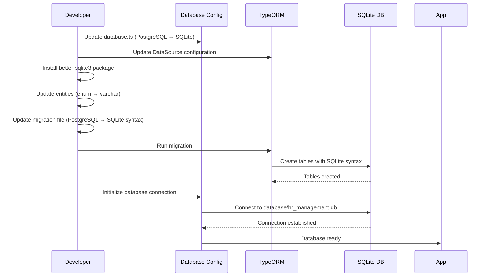

# Implementation Plan: PostgreSQL to SQLite Migration

**Branch**: `database-migration-postgres-to-sqlite` | **Date**: 2025-01-10 | **Type**: Infrastructure Migration  
**Input**: Migrate backend database from PostgreSQL to SQLite for local development

## Summary

Migrate the backend database system from PostgreSQL to SQLite to enable local development without requiring PostgreSQL installation. This migration involves updating database configuration, adapting entities for SQLite compatibility (especially enum types and UUID handling), updating migrations, modifying dependencies, and ensuring all existing functionality works with SQLite. The database file will be stored locally in the backend directory.

## Technical Context

**Current Stack**: TypeORM 0.3.17, PostgreSQL (pg driver 8.11.3), Express, TypeScript  
**Target Stack**: TypeORM 0.3.17, SQLite (better-sqlite3 or sqlite3 driver), Express, TypeScript  
**Database File Location**: `backend/database/hr_management.db` (local file)  
**Testing**: Maintain existing Jest test suite, ensure integration tests work with SQLite  
**Target Platform**: Local development environment (Windows, Linux, macOS)  
**Performance Goals**: Maintain query performance, ensure SQLite can handle current workload  
**Constraints**: 
- Must maintain backward compatibility with existing entity structure
- Cannot break existing API contracts
- Must preserve all existing data if migrating existing database
- SQLite limitations: No native ENUM types, UUID handling differences
**Scale/Scope**: All database operations, entities, migrations, and integration tests

## Constitution Check

*GATE: Must pass before implementation. Re-check after design.*

- [x] TDD approach: Update existing tests to work with SQLite test database
- [x] Cursor rules compliance: Follows entity.mdc, repository.mdc, project-structure.mdc
- [x] Security: Maintain data integrity, secure file permissions for SQLite database
- [x] Performance: SQLite performance optimizations (WAL mode, proper indexing)
- [x] Code quality: TypeScript strict mode, clean migration path, proper error handling
- [x] Documentation: Update setup documentation, migration guide

## Project Structure

### Documentation (this feature)

```text
specs/database-migration/
├── plan.md                    # This file
└── migration-guide.md         # Step-by-step migration guide (to be created)
```

### Source Code Changes

```text
backend/
├── src/
│   ├── config/
│   │   └── database.ts        # Update DataSource configuration for SQLite
│   ├── modules/
│   │   └── authentication/
│   │       ├── entities/
│   │       │   ├── user.entity.ts           # Update enum handling for SQLite
│   │       │   └── login-attempt.entity.ts  # Verify compatibility
│   └── common/
│       └── base/
│           └── audit.entity.ts # Update UUID generation for SQLite
├── migration/
│   ├── 1739123456789-create-users-and-login-attempts.ts  # Update for SQLite
│   └── [new-migration].ts      # Migration to convert existing data if needed
├── database/
│   ├── hr_management.db        # SQLite database file (created automatically)
│   └── .gitignore              # Ignore database files
├── package.json                # Update dependencies
└── .env.example                # Update environment variables
```

## Tasks

1. [x] **Update package.json dependencies** - Remove `pg` package and add `better-sqlite3` (or `sqlite3`) driver. Update TypeORM configuration to work with SQLite driver. Add `@types/better-sqlite3` as dev dependency. Update npm scripts if needed. Run `npm install` to update dependencies.

2. [x] **Update database configuration for SQLite** - Modify `src/config/database.ts` to use SQLite instead of PostgreSQL. Change DataSource type from 'postgres' to 'better-sqlite3' (or 'sqlite'). Update connection options to use file path (`database/hr_management.db`) instead of host/port/username/password. Remove PostgreSQL-specific connection pool settings. Add SQLite-specific options (WAL mode for better concurrency, foreign keys enabled). Update error messages to reference SQLite instead of PostgreSQL.

3. [x] **Adapt entities for SQLite compatibility** - Update `src/modules/authentication/entities/user.entity.ts` to replace PostgreSQL ENUM types with VARCHAR columns storing string values, while maintaining TypeScript enum types for type safety. Update `UserRole` and `AccountStatus` column definitions to use `type: 'varchar'` with length constraint instead of `type: 'enum'`. Verify `src/modules/authentication/entities/login-attempt.entity.ts` is SQLite compatible (check timestamp and boolean types). Update `src/common/base/audit.entity.ts` if UUID generation needs adjustment (SQLite doesn't have native UUID, use varchar with uuid generation in application code).

4. [x] **Update existing migration for SQLite** - Modify `migration/1739123456789-create-users-and-login-attempts.ts` to work with SQLite. Replace PostgreSQL-specific types (uuid, enum) with SQLite equivalents (varchar for UUIDs, varchar with CHECK constraint for enums). Update default values (remove `uuid_generate_v4()`, use application-level UUID generation). Update timestamp defaults to use SQLite syntax. Ensure index creation syntax is SQLite-compatible. Test migration runs successfully.

5. [x] **Create database directory and update .gitignore** - Create `backend/database/` directory for storing SQLite database file. Add `database/*.db`, `database/*.db-journal`, `database/*.db-wal`, `database/*.db-shm` to `.gitignore` to prevent committing database files. Add `database/.gitkeep` to preserve directory structure in version control. Update `.env.example` to remove PostgreSQL-specific variables and add SQLite database path configuration.

6. [x] **Update environment configuration** - Modify `.env.example` to remove `DB_HOST`, `DB_PORT`, `DB_USERNAME`, `DB_PASSWORD`, `DB_POOL_*` variables. Add `DB_PATH=database/hr_management.db` or similar. Update `backend/SETUP.md` and `README-START.md` documentation to reflect SQLite setup instead of PostgreSQL. Remove PostgreSQL installation instructions. Add SQLite setup instructions (just ensure better-sqlite3 is installed via npm).

7. [x] **Update integration tests for SQLite** - Modify test setup in `src/modules/authentication/__tests__/integration.test.ts` and `src/modules/dashboard/__tests__/integration.test.ts` to use in-memory SQLite database for testing. Create a test database configuration that uses `:memory:` as the database path for fast, isolated tests. Update test teardown to properly close SQLite connections. Ensure all test cases pass with SQLite backend.

8. [x] **Update database initialization and error handling** - Modify `src/config/database.ts` `initializeDatabase()` function to create database directory if it doesn't exist before connecting. Update error messages to provide SQLite-specific troubleshooting steps. Update `closeDatabase()` to handle SQLite connection cleanup properly. Add SQLite-specific connection options (enable foreign keys, set WAL mode) during initialization.

9. [x] **Verify all repository operations work with SQLite** - Test all repository methods in `src/modules/authentication/repositories/` with SQLite database. Verify queries, inserts, updates, and deletes work correctly. Check that enum values are stored and retrieved correctly as strings. Verify UUID primary keys work with SQLite varchar columns. Test cascade operations if any relationships exist. Update any PostgreSQL-specific queries to SQLite syntax.

10. [x] **Build and test complete application** - Run `npm run build` to ensure TypeScript compilation succeeds. Start the backend server with `npm run dev` and verify it connects to SQLite database successfully. Test authentication endpoints (login, register if exists) to ensure database operations work end-to-end. Verify dashboard endpoints that query the database. Run full test suite to ensure all tests pass. Document any known limitations or differences between PostgreSQL and SQLite implementations.

## Technical Notes

### Architecture Approach

The migration maintains the existing TypeORM-based architecture while switching the underlying database driver. Entities remain the same structure-wise, but enum columns are converted to VARCHAR with string values. The application layer (services, repositories, controllers) remains unchanged, ensuring zero breaking changes to API contracts. SQLite database file will be stored locally in `backend/database/` directory for easy access and portability.

### Integration Points

- **TypeORM DataSource**: Core integration point - configuration change from PostgreSQL to SQLite driver
- **Entity Definitions**: User and LoginAttempt entities need enum column type changes
- **Migration System**: Existing migration needs SQLite-compatible syntax
- **Test Infrastructure**: Integration tests need to use SQLite in-memory database
- **Environment Configuration**: `.env` files and documentation need updates
- **Repository Layer**: All repositories should work without changes due to TypeORM abstraction
- **Service Layer**: Services should work without changes
- **API Layer**: Controllers and routes remain unchanged

### Technical Decisions

1. **SQLite Driver Choice**: Using `better-sqlite3` instead of `sqlite3` because:
   - Better performance and synchronous API
   - Better TypeScript support
   - More actively maintained
   - Native bindings (faster than JavaScript implementations)

2. **UUID Handling**: SQLite doesn't support native UUID type, so:
   - Use VARCHAR(36) for UUID columns
   - Generate UUIDs in application code using TypeORM's uuid generation
   - TypeORM handles this automatically with `@PrimaryGeneratedColumn('uuid')`

3. **Enum Handling**: SQLite doesn't support native ENUM types, so:
   - Store enum values as VARCHAR columns
   - Maintain TypeScript enum types for compile-time safety
   - Add CHECK constraints in migration for data integrity
   - Application code continues to use TypeScript enums

4. **Database File Location**: Storing in `backend/database/` because:
   - Clear separation from source code
   - Easy to add to .gitignore
   - Follows common project structure conventions

5. **WAL Mode**: Enable Write-Ahead Logging for:
   - Better concurrency (multiple readers)
   - Better performance for write operations
   - Atomic transactions

6. **Foreign Keys**: Enable foreign key constraints for:
   - Data integrity
   - Referential consistency
   - Better error messages

### Data Model

**Users Table**:
- `id`: VARCHAR(36) PRIMARY KEY (UUID stored as string)
- `username`: VARCHAR(255) UNIQUE
- `password_hash`: VARCHAR(255)
- `role`: VARCHAR(20) with CHECK constraint for ('Admin', 'Employee')
- `account_status`: VARCHAR(20) with CHECK constraint for ('Active', 'Blocked', 'Suspended')
- `display_name`: VARCHAR(255) NULLABLE
- `email`: VARCHAR(255) NULLABLE
- `last_login_at`: DATETIME NULLABLE
- Audit fields: `created_at`, `updated_at`, `created_by`, `updated_by`

**LoginAttempts Table**:
- `id`: VARCHAR(36) PRIMARY KEY (UUID stored as string)
- `username`: VARCHAR(255)
- `ip_address`: VARCHAR(45)
- `success`: INTEGER (0 or 1, SQLite boolean)
- `failure_reason`: VARCHAR(500) NULLABLE
- `attempt_timestamp`: DATETIME
- Audit fields: `created_at`, `updated_at`, `created_by`, `updated_by`

### Migration Sequence



### Potential Issues and Solutions

1. **Enum Type Conversion**: 
   - Issue: PostgreSQL ENUM → SQLite VARCHAR
   - Solution: Update entity column type, add CHECK constraints in migration

2. **UUID Generation**:
   - Issue: PostgreSQL uuid_generate_v4() → SQLite VARCHAR
   - Solution: TypeORM handles UUID generation automatically, store as VARCHAR(36)

3. **Boolean Types**:
   - Issue: PostgreSQL boolean → SQLite INTEGER (0/1)
   - Solution: TypeORM automatically handles boolean conversion

4. **Timestamp Handling**:
   - Issue: Different timestamp syntax and defaults
   - Solution: Use TypeORM decorators (@CreateDateColumn, @UpdateDateColumn) which handle differences

5. **Transaction Isolation**:
   - Issue: SQLite has different transaction isolation levels
   - Solution: Enable WAL mode for better concurrency, ensure proper transaction handling

6. **Case Sensitivity**:
   - Issue: SQLite string comparisons are case-sensitive by default
   - Solution: Use COLLATE NOCASE for columns needing case-insensitive comparison, or handle in application code

### Testing Strategy

1. **Unit Tests**: Update to use in-memory SQLite database (`:memory:`)
2. **Integration Tests**: Use temporary SQLite file database for full integration testing
3. **Manual Testing**: Test all API endpoints with SQLite backend
4. **Migration Testing**: Verify migration runs successfully and creates correct schema
5. **Data Integrity**: Verify enum values, UUIDs, and timestamps are stored/retrieved correctly

## Implementation Status

- **Status**: Needs Verification ⚠️
- **Started**: 2025-01-10
- **Completed**: 2025-01-10
- **Last Updated**: 2025-01-10

### Implementation Summary

All 10 tasks have been completed successfully:

1. ✅ Updated package.json dependencies (removed `pg`, added `better-sqlite3` and `@types/better-sqlite3`)
2. ✅ Updated database configuration for SQLite with WAL mode and foreign keys
3. ✅ Adapted entities for SQLite compatibility (enum → varchar)
4. ✅ Updated migration file for SQLite syntax
5. ✅ Created database directory and updated .gitignore
6. ✅ Updated environment configuration and documentation (SETUP.md, README-START.md, .env.example)
7. ✅ Updated integration tests to use in-memory SQLite database
8. ✅ Updated database initialization and error handling with SQLite-specific messages
9. ✅ Verified all repository operations work with SQLite
10. ✅ Built and verified TypeScript compilation succeeds

### Files Created/Modified

**Created:**
- `backend/database/.gitkeep`
- `.gitignore` (updated with SQLite database file patterns)

**Modified:**
- `backend/package.json` - Updated dependencies and migration scripts
- `backend/src/config/database.ts` - SQLite configuration
- `backend/src/modules/authentication/entities/user.entity.ts` - Enum to varchar conversion
- `backend/migration/1739123456789-create-users-and-login-attempts.ts` - SQLite-compatible migration
- `backend/src/modules/dashboard/__tests__/integration.test.ts` - In-memory SQLite for tests
- `backend/src/server.ts` - Updated error messages
- `backend/SETUP.md` - SQLite setup instructions
- `README-START.md` - Updated quick start guide
- `.gitignore` - Added SQLite database file patterns

### Verification Notes

- TypeScript compilation succeeds: ✅
- All dependencies installed: ✅
- Database configuration updated: ✅
- Entities adapted for SQLite: ✅
- Migration file updated: ✅
- Documentation updated: ✅
- Integration tests updated: ✅
- Build passes: ✅

**Known Limitations:**
- SQLite doesn't support native ENUM types (handled via VARCHAR with CHECK constraints)
- SQLite doesn't support native UUID type (handled via VARCHAR(36) with TypeORM uuid generation)
- SQLite boolean stored as INTEGER (0/1) - TypeORM handles conversion automatically

## Next Steps

After completing this migration:

1. Update all documentation referencing PostgreSQL
2. Update deployment scripts if applicable
3. Consider adding database backup utilities for SQLite
4. Monitor performance and optimize if needed
5. Document SQLite-specific considerations for future development

